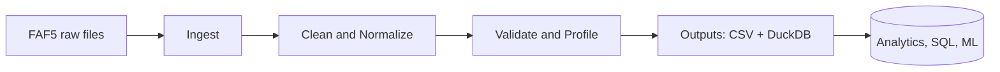

## Orbis FAF5 CSV Merger and Cleaner

[](https://github.com/Hybr1d758/orbis/actions/workflows/ci.yml)

### Overview
This project merges all FAF5 CSV files located in the `FAF5/` folder and produces:
- `FAF5/FAF5_MERGED.csv`: raw append of all CSVs with an added `source_file` column
- `FAF5/FAF5_MERGED_CLEANED.csv`: cleaned version of the merged data

The logic is implemented in `orbis.py`.

### Architecture (at a glance)


### Requirements
- Python 3.10/3.11
- pandas

Install pandas if needed:
```bash
python3 -m pip install pandas
```

### Usage
Run from the project root (same directory as `orbis.py`):
```bash
python3 orbis.py
```

Outputs are written into the `FAF5/` directory.

### Testing
Install dependencies and run tests:
```bash
python3 -m pip install -r requirements.txt
python3 -m pytest -q
```

### What the script does
1. Discovers all `.csv` files under `FAF5/`
2. Reads each CSV and appends a `source_file` column indicating the originating file
3. Concatenates all CSVs into one DataFrame and writes `FAF5_MERGED.csv`
4. Applies cleaning steps and writes `FAF5_MERGED_CLEANED.csv`
5. Generates validation profiles and issues reports

### Cleaning steps
- Normalize column names: lowercased, non-alphanumerics replaced with `_`, deduplicated
- Trim strings and convert empty strings to missing values (NA)
- Convert mostly-numeric text columns to numeric (threshold 90%)
- Drop columns that are entirely empty (all NA)
- Drop exact duplicate rows

### File locations
- Input folder: `FAF5/`
- Outputs:
  - `FAF5/FAF5_MERGED.csv`
  - `FAF5/FAF5_MERGED_CLEANED.csv`
  - `FAF5/FAF5_VALIDATION_COLUMNS.csv`
  - `FAF5/FAF5_VALIDATION_ISSUES.csv`

### Logging
The script writes structured logs with a per-run ID to the `logs/` directory and the console. Each log line includes timestamp, level, and `run_id`. Example:
```
2025-01-01 12:00:00 INFO run_id=20250101_120000_ab12cd34 orbis - Merged 1000 rows from CSV files into: FAF5/FAF5_MERGED.csv (elapsed=0.45s)
```

## Project structure
```
orbis/
  orbis.py                 # Pipeline (merge, clean, validate, log)
  orbis_pipeline/          # Package for modular pipeline (future expansion)
    __init__.py
    cli.py                 # Minimal CLI wrapper
    ingest/                # CSV/Excel/PDF ingestion (stubs)
    clean/                 # Cleaning helpers (stubs)
    validate/              # Validation helpers (stubs)
  FAF5/                    # Input data folder (CSV files)
  data/                    # (optional) raw/staged/curated outputs
  logs/                    # Run logs
  tests/                   # Pytest tests
  config/                  # (optional) mapping/allocation configs
  docs/                    # Docs and data dictionary
  requirements.txt
  pytest.ini
  README.md
```

### Data model (summary)
See `docs/data_dictionary.md` for column definitions and outputs.

### CLI usage
Run via package CLI (calls the same pipeline):
```bash
python -m orbis_pipeline.cli run
```

### DuckDB export (optional)
If `duckdb` is installed, the pipeline will also write two tables to a local database `orbis.duckdb` in the project root:
- `orbis_cleaned`: cleaned merged data (with `run_id`)
- `orbis_validation_issues`: validation issues (with `run_id`)

Example queries:
```python
import duckdb
con = duckdb.connect("orbis.duckdb")
con.sql("SELECT COUNT(*) FROM orbis_cleaned").show()
con.sql("SELECT issue_type, COUNT(*) FROM orbis_validation_issues GROUP BY 1").show()
```

## Beginner Quick Start
1) Open Terminal and go to the project folder
```bash
cd "/Users/edwardjr/Downloads/upwork /Engineering/orbis "
```
2) (Optional) Create and activate a virtual environment
```bash
python3 -m venv .venv
source .venv/bin/activate
```
3) Install dependencies
```bash
python3 -m pip install -r requirements.txt
```
4) Put your CSV files in the `FAF5/` folder

5) Run the pipeline
```bash
python -m orbis_pipeline.cli run
```
6) Check outputs in `FAF5/` and logs in `logs/`

7) (Optional) Query with DuckDB
```bash
python3 - <<'PY'
import duckdb
con = duckdb.connect("orbis.duckdb")
con.sql("SHOW TABLES").show()
con.sql("SELECT COUNT(*) FROM orbis_cleaned").show()
PY
```

## DuckDB schema (typed tables)
Optional, but helpful to lock stable types and create a "latest" view.

Open the DuckDB CLI:
```bash
cd "/Users/edwardjr/Downloads/upwork /Engineering/orbis "
duckdb orbis.duckdb
```

Create a schema, an empty typed table (add/adjust casts), and a latest view:
```sql
CREATE SCHEMA IF NOT EXISTS orbis;

-- Create an empty typed table (adjust/add columns & types as needed)
CREATE OR REPLACE TABLE orbis.cleaned_typed AS
SELECT
  CAST(run_id AS TEXT)       AS run_id,
  CAST(source_file AS TEXT)  AS source_file,
  *
FROM orbis_cleaned
LIMIT 0;

-- Load the latest run into typed table (add explicit CASTs for key columns if needed)
INSERT INTO orbis.cleaned_typed
SELECT *
FROM orbis_cleaned
WHERE run_id = (SELECT MAX(run_id) FROM orbis_cleaned);

-- Latest view for convenience
CREATE OR REPLACE VIEW orbis.cleaned_latest AS
SELECT * FROM orbis.cleaned_typed
WHERE run_id = (SELECT MAX(run_id) FROM orbis.cleaned_typed);
```

List tables with schema details:
```sql
SELECT table_schema, table_name FROM information_schema.tables ORDER BY 1,2;
```

## Use cases
- Audit vendor invoices: compare line items with rate cards; flag overcharges and exceptions.
- Consolidate operations data: unify CSV/Excel exports across vendors into a single model.
- Analytics foundation: produce curated Parquet or DuckDB tables for BI and ad‑hoc SQL.
- ML readiness: generate stable, validated features for downstream training jobs.
- Data quality monitoring: automate profiling and issue reporting per run.

## Challenges & lessons learned
- Schema drift: vendor files change; solve with column normalization and config‑driven mappings.
- Messy inputs: empty/duplicate rows, subtotals, mixed types; robust cleaning and validation help.
- Performance: CSV parsing can be slow; prefer Parquet for curated outputs and DuckDB for queries.
- Reproducibility: run IDs, logs, and tests make it easy to trace and rerun safely.
- Extensibility: modular structure (ingest/clean/validate/enrich/allocate) enables adding sources.

## Security & privacy
- No real PII should be committed to this repo. Use sanitized samples only.
- Secrets/keys should not be hard-coded; use environment variables or a `.env` file (not included).
- Large outputs, logs, and local databases are `.gitignore`'d.

## Results (example)
Example run artifacts:
- Logs: `logs/orbis_<run_id>.log`
- Outputs: `FAF5/FAF5_MERGED.csv`, `FAF5/FAF5_MERGED_CLEANED.csv`, `FAF5/FAF5_VALIDATION_*.csv`
- DuckDB: `orbis.duckdb` with `orbis_cleaned` and `orbis_validation_issues`

Quick check (DuckDB):
```sql
SELECT COUNT(*) FROM orbis_cleaned;
SELECT issue_type, COUNT(*) FROM orbis_validation_issues GROUP BY 1 ORDER BY 2 DESC;
```

## Roadmap
- Add Excel/PDF source parsers and config-driven mappings
- Export curated Parquet and register with DuckDB/Glue
- Great Expectations suite with HTML Data Docs
- Prefect flow (DAG) with retries and run metadata
- dbt models over curated outputs (optional)

## Author's role
- Designed and implemented ingestion → cleaning → validation pipeline
- Added structured logging, tests, and DuckDB export with `run_id`
- Wrote documentation and beginner-friendly run instructions